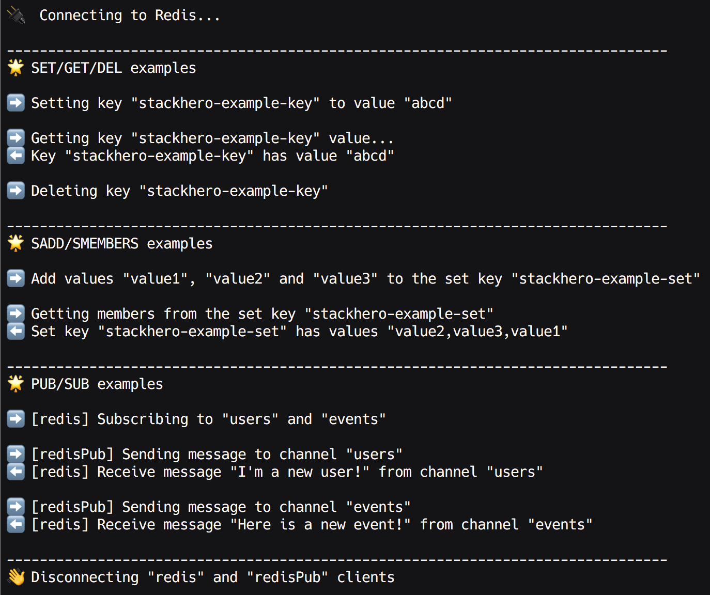

# Valkey getting started

## How to send data from Node.js to Valkey

You can find here some examples of Node.js code to send data to a Valkey server.

These examples are designed to run with a Stackhero Valkey service.
You'll more informations about Stackhero here:
- [Valkey cloud](https://www.stackhero.io/en/services/Valkey/benefits)
- [Valkey pricing](https://www.stackhero.io/en/services/Valkey/pricing)
- [Valkey documentations](https://www.stackhero.io/en/services/Valkey/documentations)

## How to use

- First, clone this repository: `git clone https://github.com/stackhero-io/valkeyGettingStarted.git && cd valkeyGettingStarted`
- Then, install nodes packages: `npm install`
- Copy the file `.env-example` to `.env` and fill it with your credentials
- Finally, start the first example: `node gettingStarted.js`

This example use the `ioredis` library.
You will find documentation on the official [Github repository](https://github.com/luin/ioredis)

